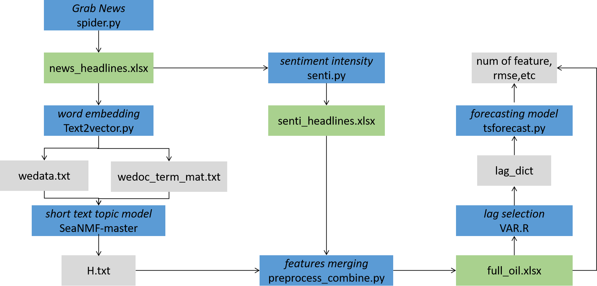

# Text-based crude oil price forecasting

This project contains the Python and R codes for forecasting crude oil price based on news headlines.



Following the above flowchart, one can complete the basic forecasting steps.

Dependency packages
-----------
All codes in this project are written in Python 3.6 and R 3.6.1. Before experiment with the codes, we recommend you to install these two softwares. The dependency packages for Python are listed below:
```python
pip install numpy==1.18.5
pip install pandas==0.25.3
pip install selenium==3.14.1
pip install textblob==0.15.3
pip install scikit-learn==0.21.3
pip install nltk==3.4
pip install Keras==2.2.4
pip install statsmodels==0.11.1
```

##2323
---------
- hu

- huhn

